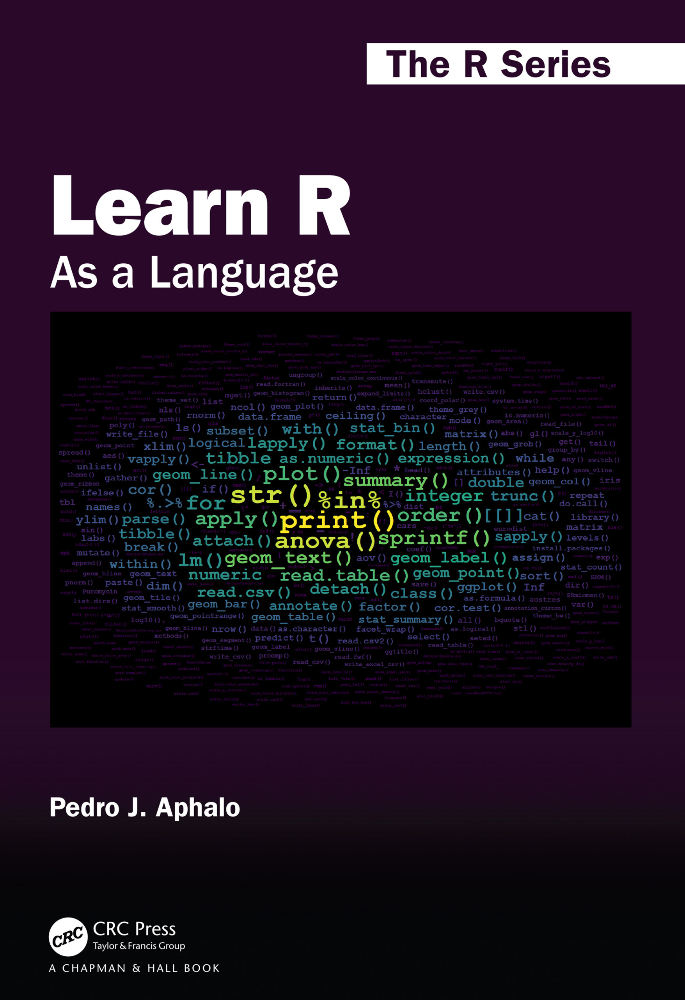

```{r setup, include=FALSE}
knitr::opts_chunk$set(echo = TRUE, eval = FALSE)
```

## Introduction

I created the word cloud on the cover of "Learn R: As a Language" using an R script that takes as input the file for the book index, as generated when creating the PDF from the LaTeX source files. This input file contained quite a lot of additional information, like font changes and page numbers that needed to be stripped into a clean list of words. Only later I realized that it would have been easier to produce a cleaner word list to start with. So, I here present the revised code. This is actually tested with the book files to work. If you want to do something similar for your own book, report or thesis you can easily edit the code

## The word cloud

The word cloud that appears on the cover of the book is based on the frequency, or number of times, with which each R function or command appears in the index included at the back of the book. The wordcloud is a ggplot where frequency is mapped to both `colour` and `size` aesthetics and the text of the index entries is mapped to the `label` aesthetic. The positioning is automatically done by `geom_text_wordcloud()`. I used one of the Vididis colour scales.

{width="300"}

## Reusable code

First I need to explain how I encoded index entries in the $\LaTeX$ `.Rnw` source files. I did not use `\index` directly in the `.Rnw` source file but instead defined macros wrapping this command from index building system of $\LaTeX$. In the case of macros for indexing **R** related words, the macros also added the mark up (font and shading) used in the main text in the same operation. In fact, I defined different macros for functions, classes, etc., even if some of the definitions were initially identical. This added a lot of flexibility; a flexibility that helped greatly when implementing the code for the word cloud.

I show here only the macro for **R** _functions_ as an example, although I also used similar macros for _methods_, _classes_, _operators_, etc., which allowed automating the hierarchical grouping of entries in the  index.

```{text}
\newcommand{\Rfunction}[1]{\textt{#1}\index[rindex]{#1@\texttt{#1}}\index[rcatsidx]{functions and methods!#1@\texttt{#1}}\xspace}
```

Those familiar with $\LaTeX$ will notice that the macro as defined above adds the argument to two different indexes, and encodes the argument in a "typewriter" font both in the main text and the two indexes.

To generate a list of words without formatting mark-up, an additional index file named `cloudindex.idx` I added `\index[cloudindex]{#1}` to this and similar \\$\LaTeX$ macros. I also added in the preamble of the book's main source `.Rnw` file `\makeindex[name=cloudindex]` but did not add a `\printindex` for this index, so that it is not included in the book PDF.

``` {text}
\newcommand{\Rfunction}[1]{\code{#1}\index[rindex]{#1@\texttt{#1}}\index[rcatsidx]{functions and methods!#1@\texttt{#1}}\index[cloudindex]{#1}\xspace}
```

The contents of the file `cloudindex.idx` created when building the book PDF looks as follows, with rows ordered by page number, and containing one row for each call to `\index` (only first few out of more than 1000 lines are shown):

``` {text}
\indexentry{print()}{6}
\indexentry{help()}{11}
\indexentry{help()}{11}
\indexentry{help()}{11}
\indexentry{citation()}{12}
\indexentry{numeric}{18}
\indexentry{+}{18}
\indexentry{-}{18}
\indexentry{*}{18}
\indexentry{/}{18}
...
```

The R code used for extracting words, counting the number of entries for each word and assembling a `tibble` suitable as `data` argument for `ggplot()` is shown next.

``` {r}
library(ngram)
library(ggplot2)
library(ggwordcloud)
library(dplyr)
library(tidytext)
library(stringr)
library(wrapr)

# define a function to extract index entries
clean_words <- function(x) { x %.>%
    # remove laTeX commands
    gsub("\\\\indexentry|\\\\textbar|\\\\ldots", "", x = .) %.>%
    # remove page numbers
    gsub("[{][0-9]*[}]", "", x = .) %.>%
    # remove all quotation marks
    gsub('\\\\\"|\\\"|\\"', '', x = .) %.>%
    # replace scaped characters
    gsub("\\\\_", "_", x = .) %.>%
    gsub("\\\\%", "%", x = .) %.>%
    gsub("\\\\[$]|\\[$]", "$", x = .) %.>% # $ needs to be protected
    gsub("\\\\&|\\&", "&", x = .) %.>%
    gsub("\\\\^|\\^", "^", x = .) %.>%
    # remove brackets
    gsub("[{]|[}]", "", x = .)
}

# read all index files, each one into a single character string
list.files(path = ".", pattern = "*.idx$")
indexed.words <- multiread(extension=".idx", prune.empty = FALSE)
# find the index we want to use
names(indexed.words)

# we grab the first one (edit index "1" as needed)
my.idx <- clean_words(indexed.words[[1]]) 
# check what we have got 
string.summary(my.idx) 
# split index entries into strings, sort and count their frequency 
my.idx %.>%
  str_split(., " ") %.>%
  unlist(.) %.>%
  sort(.) %.>%
  rle(.) %.>% # rle is "run length encoding"
  tibble(lengths = .$lengths, values = .$values) %.>%
  filter(., !values %in% c("", "NA")) %.>% # to be excluded
  dplyr::arrange(., desc(lengths)) -> word_counts.tb

# number of distinct index entries
nrow(word_counts.tb)
# the six most frequent index entries
head(word_counts.tb)
```

We plot the data as a word cloud using 'ggplot2' and package 'ggwordcloud'. The values used as arguments for `grid_margin`, `max_size`, and the number of index entries or "words" plotted were selected by trial and error.

``` {r}
word_cloud.fig0 <-
 # we use the 180 most frequent entries
  ggplot(word_counts.tb[1:180, ],
         aes(label = values,
             size = lengths,
             color = lengths)) +
  geom_text_wordcloud(family = "mono",
                      fontface = "bold",
                      area_corr = TRUE,
                      grid_margin = 2,
                      seed = 42) +
  scale_size_area(max_size = 11) +
  scale_color_viridis_c() +
  theme_minimal() +
  theme(aspect.ratio = 5/7)
```

We next give examples of how to create PNG files and of how style variations can also produced by "editing" a ggplot. It is important to be aware, that in these examples the background color was set when calling the `png()` device (equivalent to feeding paper of a different color to a printer) as is not coded as part of the ggplot. Of course, other R graphic devices can be used as well.

``` {r}
# the word cloud used in the cover
# note that the background color is set when opening the device
png("CRC/web-examples/learnrbook-cover-image-300-0.png",
    width = 2100, height = 1500, res = 300, bg = "black")
print(word_cloud.fig0)
dev.off()

# two examples using different palettes
word_cloud.fig1 <-
  word_cloud.fig0 %+% scale_color_viridis_c(option = "B")

png("CRC/web-examples/learnrbook-cover-image-300-1.png",
    width = 2100, height = 1500, res = 300, bg = "grey25")
print(word_cloud.fig1)
dev.off()

word_cloud.fig2 <-
  word_cloud.fig0 %+% scale_color_viridis_c(option = "C")

png("CRC/web-examples/learnrbook-cover-image-300-2.png",
    width = 2100, height = 1500, res = 300, bg = "black")
print(word_cloud.fig2)
dev.off()
```

In fact once we realize what needs to be done, and which are the most appropriate tools, a simple script can get the job done elegantly.

The bitmap from the last example, which might have made it to the cover, is somewhat warmer in tone, but still overall matching the usual colours on the covers of books in _The R Series_. It also slightly differs from that on the book cover as a bug in the original script caused too high a count for the `%in%` index entry.


